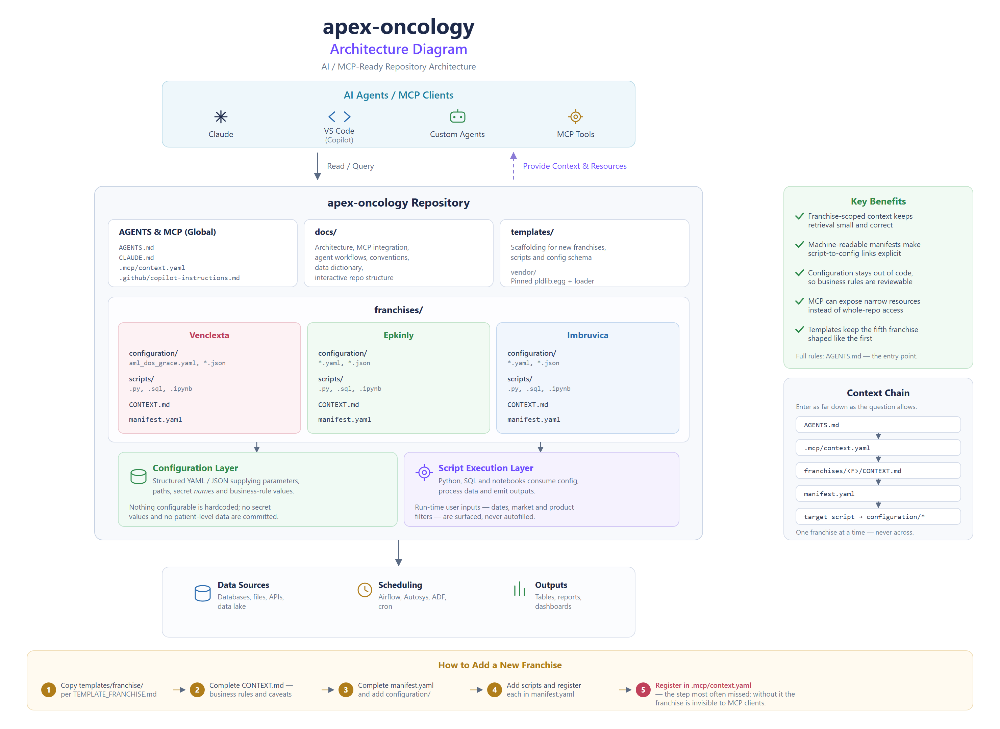

# apex-oncology

AI-agent and MCP-ready repository for oncology franchise configuration, scripts,
metadata and context.

Testing repository for various franchises in oncology.

**Franchises:** Venclexta · Epkinly · Imbruvica
**Workloads:** Python (`.py`) · SQL (`.sql`) · Jupyter notebooks (`.ipynb`) · YAML/JSON config



An interactive structure diagram is at [`docs/repo-structure.html`](docs/repo-structure.html) —
open it in a browser.

---

## Start here

| You are | Read |
|---|---|
| An AI agent or MCP client | **[`AGENTS.md`](AGENTS.md)** — the authoritative operating rules |
| Using Claude Code | [`CLAUDE.md`](CLAUDE.md) |
| Using Gemini | [`GEMINI.md`](GEMINI.md) |
| Using Copilot | [`.github/copilot-instructions.md`](.github/copilot-instructions.md) |
| A human, new to the repo | [`docs/architecture.md`](docs/architecture.md) |

All the client-specific files defer to `AGENTS.md`. Change rules there, not in four
places.

## Structure

```
apex-oncology/
├── AGENTS.md CLAUDE.md GEMINI.md    agent entry points
├── .github/                          Copilot instructions, PR template
├── .mcp/context.yaml                 machine-readable repo map + MCP discovery
├── docs/                             architecture, workflows, conventions, data dictionary
├── franchises/
│   ├── Venclexta/
│   │   ├── CONTEXT.md                business + technical context
│   │   ├── manifest.yaml             script inventory and dependencies
│   │   ├── configuration/            YAML/JSON consumed by scripts
│   │   └── scripts/                  .py, .sql, .ipynb workloads
│   ├── Epkinly/                      same structure
│   └── Imbruvica/                    same structure
└── templates/                        scaffolding for new franchises and scripts
```

Each franchise is **self-contained** — its own context, inventory, configuration and
scripts.

## Context chain

```
AGENTS.md → .mcp/context.yaml → franchises/<F>/CONTEXT.md → manifest.yaml
          → target script → configuration/*
```

Enter as far down the chain as your question allows. A question about a specific script
starts at that franchise's manifest, not at the top.

## The rules that matter most

**Scope to one franchise.** A Venclexta question is answered from
`franchises/Venclexta/` alone. This is not just efficiency — franchises have genuinely
different business rules, data sources and owners, so reading across them produces
answers that are fluent and wrong.

**Read the manifest before searching.** `manifest.yaml` already records each script's
inputs, outputs and config dependencies. Use it instead of grepping. If the manifest and
the script disagree, the script is the truth and the manifest is stale — fix it and
report the drift.

**Surface unresolved user inputs.** Blank dates, empty `IN ()` lists and unset market or
product filters are deliberate run-time inputs, not defects. Name them; never autofill.

**Keep configuration out of code.** Parameters, paths, secret *names* and business-rule
values live in `configuration/`. Nothing configurable gets hardcoded.

**Never commit secrets or data.** No credentials, no patient-level or identifiable data,
no notebook outputs, no extracts. Configuration names a secret; the value resolves at run
time. Full detail in [`AGENTS.md`](AGENTS.md) §6.

## Why this layout works for agents

- Context is scoped by franchise, so retrieval stays small and correct.
- Manifest metadata makes script-to-config dependencies explicit rather than discoverable.
- MCP can expose narrow resources instead of whole-repository file access.
- Templates keep the fifth franchise shaped like the first.

## Suggested MCP surface

```
get_repo_context()
get_franchise_context(franchise)
get_franchise_manifest(franchise)
get_script_dependencies(franchise, script)
search_context(query, franchise?)
```

Rationale and implementation guidance: [`docs/mcp-integration.md`](docs/mcp-integration.md).

## Example agent query

> For Venclexta, explain the purpose of `<script>`, identify all configuration files it
> consumes, and summarize the business rules that can change its output.

Resolution path: franchise context → manifest → script → configuration. `Epkinly` and
`Imbruvica` are never opened.

## Documentation

| Document | Contents |
|---|---|
| [`AGENTS.md`](AGENTS.md) | Global operating rules, conventions, safety |
| [`docs/architecture.md`](docs/architecture.md) | Layers, dependency model, ownership, boundaries |
| [`docs/agent-workflows.md`](docs/agent-workflows.md) | Nine workflows for discovery and code change, plus anti-patterns |
| [`docs/mcp-integration.md`](docs/mcp-integration.md) | MCP resources, tools, retrieval strategy, server guidance |
| [`docs/conventions.md`](docs/conventions.md) | Naming, placement, manifest fields, annotation depth |
| [`docs/data-dictionary.md`](docs/data-dictionary.md) | Authoritative table, field and metric definitions |

## Skills

Guided, validated procedures for changes that are easy to get wrong. Prefer the skill
over editing the target file freehand — each one shows current state, confirms before
writing, validates after, and prompts for the follow-ups.

| Skill | Purpose |
|---|---|
| [`/update-dos-grace`](.claude/skills/update-dos-grace/SKILL.md) | Update DOS or GRACE values for AML line-of-therapy validation (Venclexta) — one product, several, all, or a new entry |

## Adding a franchise

Copy `templates/`; don't hand-roll. Steps and checklist:
[`templates/TEMPLATE_FRANCHISE.md`](templates/TEMPLATE_FRANCHISE.md).

1. Copy `templates/franchise/` to `franchises/<NewFranchise>/`, add `configuration/` and `scripts/`
2. Complete `CONTEXT.md` — business rules and known caveats especially
3. Complete `manifest.yaml`
4. Add config files following [`templates/config_schema.yaml`](templates/config_schema.yaml)
5. Add scripts and register each in `manifest.yaml`
6. **Register the franchise in [`.mcp/context.yaml`](.mcp/context.yaml)** — the step most often missed

A franchise absent from `.mcp/context.yaml` is invisible to MCP clients even though every
file exists.

## Adding a script

Follow [`templates/TEMPLATE_SCRIPT.md`](templates/TEMPLATE_SCRIPT.md) for the header
block and annotation rules. Register it in the franchise `manifest.yaml` in the same
change, keep configurable values in `configuration/`, and clear notebook outputs before
committing.

## Current status

The structure, conventions and agent guidance are complete. Franchise content is
scaffolded — `CONTEXT.md` files and manifests carry `TODO` markers for the franchise
owners to complete, and no scripts or configuration have been migrated in yet.

`TODO` means *not yet recorded*, not *not required*. Agents are instructed to say so
rather than infer across franchises, so completing the `CONTEXT.md` business rules and
known caveats sections is the highest-value next step.
